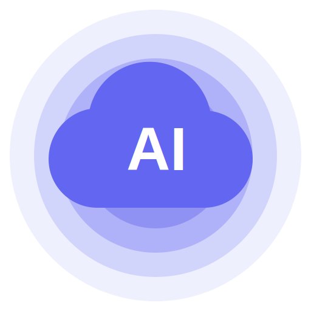
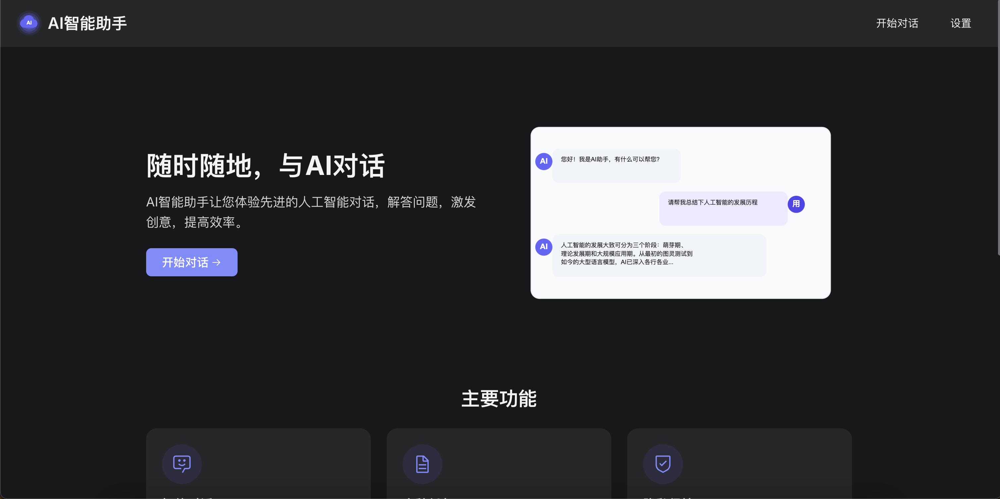
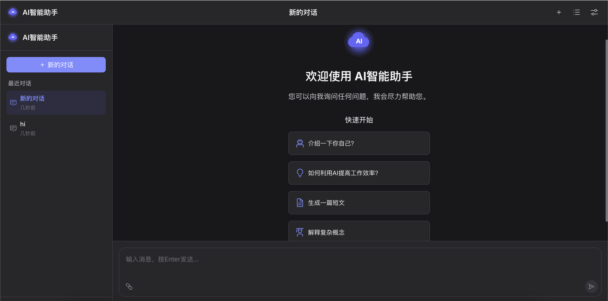
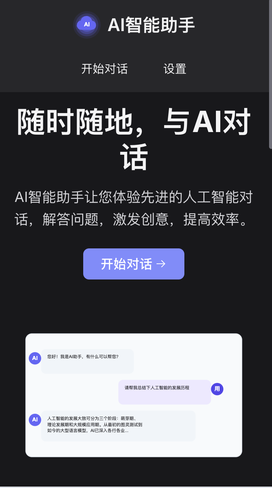
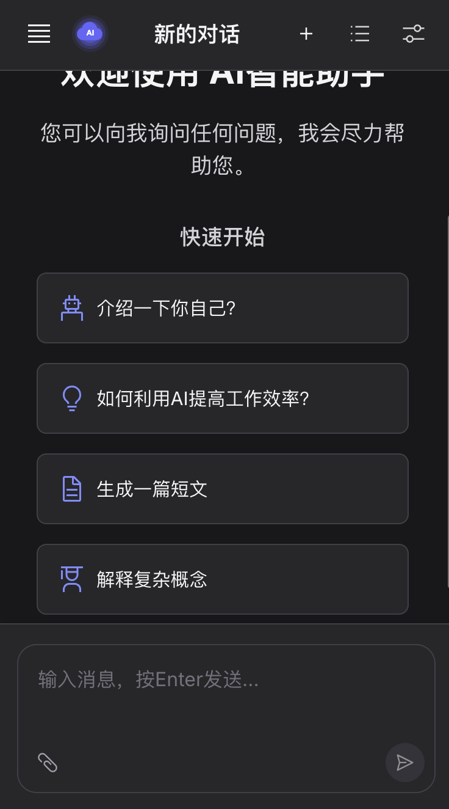

# AI智能助手

<p align="center">
  
</p>

<p align="center">
  一个基于Vue3开发的现代化AI对话应用，提供流畅、直观的用户体验
</p>

## 项目概述

AI智能助手是一个完全响应式的Web应用，支持PC端和移动端，提供智能对话服务。本项目采用Vue3、Pinia和Vite构建，具有美观的UI设计和流畅的交互体验。

### 主要特性

- **智能对话**：基于先进AI模型，提供自然、流畅的对话体验
- **多端适配**：完美兼容桌面端和移动端设备
- **对话管理**：支持创建、切换、删除多个对话
- **主题切换**：支持亮色/暗色主题，自动适应系统设置
- **丰富定制**：多种应用设置，满足不同用户需求
- **响应式布局**：从手机到大屏显示器的完美适配

## 技术栈

- **前端框架**：Vue 3 (Composition API)
- **状态管理**：Pinia
- **路由管理**：Vue Router
- **构建工具**：Vite
- **样式预处理**：SCSS
- **UI组件**：自定义组件
- **图标系统**：Iconify + Carbon图标
- **工具库**：
  - VueUse
  - Marked (Markdown渲染)
  - Day.js (日期处理)
  - Axios (HTTP请求)

## 多端适配设计

本项目从设计之初就考虑了多端适配的需求，采用了多种技术手段确保在不同设备上都能提供良好的用户体验：

### 响应式布局

- **灵活的网格系统**：基于CSS Grid和Flexbox实现自适应布局
- **移动优先**：采用移动优先的设计理念，确保在小屏设备上的良好体验
- **媒体查询**：使用SCSS媒体查询实现不同断点的样式适配
- **视口单位**：使用vh/vw等视口单位，结合CSS变量实现流畅缩放

### 移动端特殊优化

- **触摸友好**：较大的点击区域，适合触摸操作
- **侧边栏适配**：在移动端自动转为可隐藏的侧滑菜单
- **键盘适配**：适应移动设备虚拟键盘弹出时的布局调整
- **100vh问题解决**：特别处理了移动浏览器100vh的兼容性问题
- **设备方向感知**：响应设备的横竖屏切换

### 桌面端增强

- **快捷键支持**：为常用操作提供键盘快捷键
- **悬停效果**：桌面端特有的悬停交互效果
- **更多信息密度**：在大屏上展示更丰富的信息
- **宽屏优化**：针对超宽屏幕的特殊布局优化

## 项目结构

```
src/
├── api/           # API接口
├── assets/        # 静态资源
├── components/    # 公共组件
│   ├── AppHeader.vue      # 应用头部
│   ├── AppSidebar.vue     # 侧边栏
│   ├── MessageItem.vue    # 消息项
│   └── MessageInput.vue   # 消息输入框
├── router/        # 路由配置
├── stores/        # Pinia状态管理
│   ├── chat.js           # 对话状态
│   └── settings.js       # 设置状态
├── styles/        # 全局样式
│   ├── main.scss         # 主样式文件
│   └── variables.scss    # 样式变量
├── utils/         # 工具函数
├── views/         # 页面视图
│   ├── Chat.vue          # 对话页面
│   ├── Home.vue          # 首页
│   ├── Settings.vue      # 设置页面
│   └── NotFound.vue      # 404页面
├── App.vue        # 根组件
└── main.js        # 入口文件
```

## 安装与运行

```bash
# 克隆项目
git clone [仓库地址]

# 进入项目目录
cd ai-chat-app

# 安装依赖
npm install

# 启动开发服务器
npm run dev

# 构建生产版本
npm run build
```

## 自适应特性说明

1. **动态布局切换**：
   - 移动端（<768px）：侧边栏默认隐藏，需点击菜单按钮显示
   - 平板/小屏桌面（768px-992px）：简化布局，调整部分元素大小
   - 桌面端（>992px）：完整布局显示

2. **组件响应式行为**：
   - 消息容器：自动调整高度和内边距
   - 输入框：在移动端简化操作按钮
   - 导航栏：移动端显示汉堡菜单，隐藏部分文字标签

3. **交互适配**：
   - 触摸设备：优化触摸目标大小
   - 桌面设备：提供更丰富的悬停效果和额外信息

## 屏幕截图

### PC端效果展示

<div align="center">
  
  <p>PC端聊天界面 - 亮色模式</p>
</div>

<div align="center">
  
  <p>PC端设置界面 - 深色模式</p>
</div>

### 移动端效果展示

<p align="center">
  
  <br>
  <em>移动端聊天界面</em>
</p>

<p align="center">
  
  <br>
  <em>移动端侧边菜单</em>
</p>

## 浏览器兼容性

- Chrome/Edge (最新版)
- Firefox (最新版)
- Safari (最新版)
- iOS Safari (最新版)
- Android Chrome (最新版)

## 许可协议

[添加适合的许可协议] 